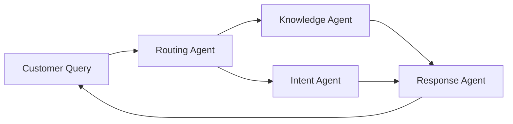
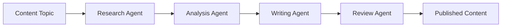
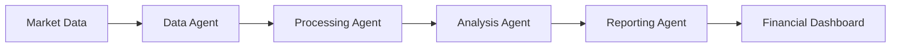

# Agent Mesh Protocol

[](https://opensource.org/licenses/MIT)
[](docs/protocol-specification.md)
[](https://github.com/agentmeshprotocol/agentmeshprotocol)

**A standardized protocol for autonomous AI agent communication and collaboration across frameworks.**

Agent Mesh Protocol (AMP) enables AI agents built with different frameworks—LangChain, CrewAI, AutoGen, or custom implementations—to discover, communicate, and collaborate seamlessly within a mesh network.

## 🚀 Quick Start

### Python
```bash
pip install agent-mesh-protocol
```

```python
from amp import AMPClient, AMPAgent
from amp.capabilities import TextAnalysis

# Create an agent with text analysis capability
agent = AMPAgent(
    agent_id="my-agent",
    name="Text Processor",
    capabilities=[TextAnalysis()]
)

# Connect to the mesh
client = AMPClient()
await client.connect()
await client.register_agent(agent)
```

### TypeScript
```bash
npm install @agentmeshprotocol/sdk
```

```typescript
import { AMPClient, AMPAgent, TextAnalysis } from '@agentmeshprotocol/sdk';

// Create an agent with text analysis capability
const agent = new AMPAgent({
    agentId: 'my-agent',
    name: 'Text Processor',
    capabilities: [new TextAnalysis()]
});

// Connect to the mesh
const client = new AMPClient();
await client.connect();
await client.registerAgent(agent);
```

## 🎯 Key Features

- **🔄 Framework Agnostic** - Works with LangChain, CrewAI, AutoGen, and custom frameworks
- **📡 Multiple Transports** - HTTP/REST, WebSocket, Message Queues, gRPC
- **🛡️ Enterprise Security** - Authentication, authorization, message signing, audit logging
- **📊 Built-in Observability** - Monitoring, metrics, and debugging capabilities
- **🎨 Capability-Based** - Standardized capability taxonomy and discovery
- **⚡ Production Ready** - Scalable architecture with error handling and retry logic

## 🌐 Use Cases

### Customer Support Automation


### Content Creation Pipeline


### Financial Analysis System


## 📚 Documentation

### Core Documentation
- **[Protocol Specification](docs/protocol-specification.md)** - Complete AMP protocol specification
- **[Capability Taxonomy](docs/capability-taxonomy.md)** - Standardized agent capability definitions
- **[Implementation Guide](docs/implementation-guide.md)** - Step-by-step implementation guide
- **[Security Guidelines](docs/SECURITY.md)** - Security best practices and guidelines

### SDKs and Examples
- **[Python SDK](https://github.com/agentmeshprotocol/amp-python-sdk)** - Official Python implementation
- **[TypeScript SDK](https://github.com/agentmeshprotocol/amp-typescript-sdk)** - Official TypeScript implementation
- **[Examples Repository](https://github.com/agentmeshprotocol/amp-examples)** - Code examples and tutorials
- **[Community Resources](https://github.com/agentmeshprotocol/amp-community)** - Community contributions

### Reference Implementations
- **[Python Reference](src/README.md)** - Python reference implementation
- **[TypeScript Reference](src/README.md)** - TypeScript reference implementation
- **[Validation Tools](tests/README.md)** - Protocol compliance testing tools
- **[Example Implementations](examples/README.md)** - Complete working examples


## 🏗️ Repository Structure

This repository contains the core protocol specification and reference implementations:

```
agentmeshprotocol/
├── docs/                    # Protocol documentation
│   ├── protocol-specification.md  # Core AMP protocol specification
│   ├── capability-taxonomy.md     # Standardized capability definitions
│   ├── implementation-guide.md    # Implementation guidelines
│   └── SECURITY.md               # Security guidelines
├── src/                     # Reference implementations
│   └── README.md           # Implementation details
├── tests/                   # Protocol compliance tests
│   └── README.md           # Testing guidelines
└── examples/               # Example implementations
    └── README.md           # Example catalog
```

## 🔧 Related Repositories

### Official SDKs
- **[amp-python-sdk](https://github.com/agentmeshprotocol/amp-python-sdk)** - Official Python SDK
- **[amp-typescript-sdk](https://github.com/agentmeshprotocol/amp-typescript-sdk)** - Official TypeScript SDK

### Documentation and Examples
- **[amp-docs](https://github.com/agentmeshprotocol/amp-docs)** - Documentation website source
- **[amp-examples](https://github.com/agentmeshprotocol/amp-examples)** - Comprehensive example gallery

### Community
- **[amp-community](https://github.com/agentmeshprotocol/amp-community)** - Community resources and discussions

## 🤝 Contributing

We welcome contributions from the community! Here's how you can help:

### Quick Contributions
- **🐛 Report Bugs** - [Open an issue](https://github.com/agentmeshprotocol/agentmeshprotocol/issues/new?template=bug_report.md)
- **💡 Request Features** - [Suggest improvements](https://github.com/agentmeshprotocol/agentmeshprotocol/issues/new?template=feature_request.md)
- **📖 Improve Docs** - Help us improve documentation
- **🔍 Review PRs** - Help review pull requests

### Development Contributions
- **🔧 Core Protocol** - Improve the protocol specification
- **📦 Reference Implementations** - Enhance Python/TypeScript implementations
- **🧪 Testing** - Add tests and improve validation
- **🎯 Examples** - Create new examples and tutorials

### Getting Started with Development
1. **Fork and Clone**
   ```bash
   git clone https://github.com/YOUR_USERNAME/agentmeshprotocol.git
   cd agentmeshprotocol
   ```

2. **Set Up Development Environment**
   ```bash
   # Python development
   python -m venv venv
   source venv/bin/activate  # On Windows: venv\Scripts\activate
   pip install -e ".[dev]"
   
   # TypeScript development
   npm install
   npm run build
   ```

3. **Run Tests**
   ```bash
   # Python tests
   pytest tests/
   
   # TypeScript tests
   npm test
   
   # Protocol compliance tests
   python -m amp.validation.compliance_checker
   ```

4. **Submit Changes**
   - Create a feature branch
   - Make your changes
   - Add/update tests
   - Update documentation
   - Submit a pull request

For detailed contribution guidelines, see [CONTRIBUTING.md](CONTRIBUTING.md).

## 📄 License

This project is licensed under the MIT License - see the [LICENSE](LICENSE) file for details.

## 🌟 Community and Support

### Get Help
- **📚 Documentation** - [Protocol Specification](docs/protocol-specification.md)
- **🐛 GitHub Issues** - [Report bugs and request features](https://github.com/agentmeshprotocol/agentmeshprotocol/issues)
- **💬 Discussions** - [Join the conversation](https://github.com/agentmeshprotocol/amp-community/discussions)

### Stay Updated
- **📖 GitHub** - Watch this repository for updates
- **🤝 Community** - [Community resources](https://github.com/agentmeshprotocol/amp-community)


## 🚀 Roadmap

### Version 1.1 (Q2 2024)
- [ ] Enhanced security features (OAuth 2.0, RBAC)
- [ ] Visual agent builder and workflow designer
- [ ] Advanced monitoring and analytics dashboard
- [ ] Multi-cloud deployment support

### Version 1.2 (Q3 2024)
- [ ] Real-time collaboration features
- [ ] Advanced caching and performance optimizations
- [ ] Plugin system for custom capabilities
- [ ] Integration with major cloud AI services

### Version 2.0 (Q4 2024)
- [ ] Protocol extensions for specialized domains
- [ ] Enhanced multi-modal capabilities
- [ ] Advanced workflow orchestration
- [ ] Enterprise governance features

See our [public roadmap](https://github.com/agentmeshprotocol/amp-community/blob/main/ROADMAP.md) for detailed planning and progress updates.

---

**Ready to build the future of agent collaboration?** 

[Read Specification](docs/protocol-specification.md) • [View Examples](https://github.com/agentmeshprotocol/amp-examples) • [Join Community](https://github.com/agentmeshprotocol/amp-community/discussions)

*Agent Mesh Protocol - Making AI agent interoperability simple, secure, and scalable.*