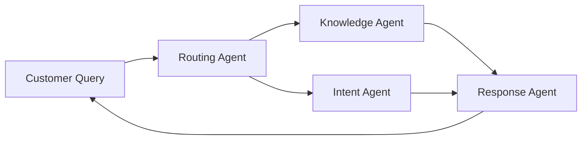
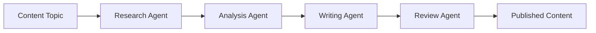
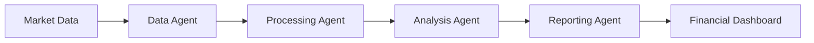

# Agent Mesh Protocol

[](https://docs.agentmeshprotocol.io)
[](https://pypi.org/project/agent-mesh-protocol/)
[](https://www.npmjs.com/package/@agentmeshprotocol/sdk)
[](https://opensource.org/licenses/MIT)
[](https://discord.gg/agentmeshprotocol)

**A standardized protocol for autonomous AI agent communication and collaboration across frameworks.**

Agent Mesh Protocol (AMP) enables AI agents built with different frameworks—LangChain, CrewAI, AutoGen, or custom implementations—to discover, communicate, and collaborate seamlessly within a mesh network.

## 🚀 Quick Start

### Python
```bash
pip install agent-mesh-protocol
```

```python
from amp import AMPClient, AMPAgent
from amp.capabilities import TextAnalysis

# Create an agent with text analysis capability
agent = AMPAgent(
    agent_id="my-agent",
    name="Text Processor",
    capabilities=[TextAnalysis()]
)

# Connect to the mesh
client = AMPClient()
await client.connect()
await client.register_agent(agent)
```

### TypeScript
```bash
npm install @agentmeshprotocol/sdk
```

```typescript
import { AMPClient, AMPAgent, TextAnalysis } from '@agentmeshprotocol/sdk';

// Create an agent with text analysis capability
const agent = new AMPAgent({
    agentId: 'my-agent',
    name: 'Text Processor',
    capabilities: [new TextAnalysis()]
});

// Connect to the mesh
const client = new AMPClient();
await client.connect();
await client.registerAgent(agent);
```

## 🎯 Key Features

- **🔄 Framework Agnostic** - Works with LangChain, CrewAI, AutoGen, and custom frameworks
- **📡 Multiple Transports** - HTTP/REST, WebSocket, Message Queues, gRPC
- **🛡️ Enterprise Security** - Authentication, authorization, message signing, audit logging
- **📊 Built-in Observability** - Monitoring, metrics, and debugging capabilities
- **🎨 Capability-Based** - Standardized capability taxonomy and discovery
- **⚡ Production Ready** - Scalable architecture with error handling and retry logic

## 🌐 Use Cases

### Customer Support Automation

```mermaid
graph LR
    Customer[Customer Query] --> Router[Routing Agent]
    Router --> KB[Knowledge Agent]
    Router --> Intent[Intent Agent]
    KB --> Response[Response Agent]
    Intent --> Response
    Response --> Customer
```

### Content Creation Pipeline

```mermaid
graph LR
    Topic[Content Topic] --> Research[Research Agent]
    Research --> Analysis[Analysis Agent]
    Analysis --> Writing[Writing Agent]
    Writing --> Review[Review Agent]
    Review --> Published[Published Content]
```

### Financial Analysis System

```mermaid
graph LR
    Data[Market Data] --> Collector[Data Agent]
    Collector --> Processor[Processing Agent]
    Processor --> Analyzer[Analysis Agent]
    Analyzer --> Reporter[Reporting Agent]
    Reporter --> Dashboard[Financial Dashboard]
```

## 📚 Documentation

### Getting Started
- **[Introduction](https://docs.agentmeshprotocol.io/docs/getting-started/introduction)** - What is Agent Mesh Protocol?
- **[Installation](https://docs.agentmeshprotocol.io/docs/getting-started/installation)** - Set up your development environment
- **[Quick Start](https://docs.agentmeshprotocol.io/docs/getting-started/quick-start)** - Build your first agent mesh in 10 minutes
- **[Your First Agent](https://docs.agentmeshprotocol.io/docs/getting-started/first-agent)** - Detailed agent creation guide
- **[Basic Concepts](https://docs.agentmeshprotocol.io/docs/getting-started/basic-concepts)** - Core AMP concepts

### Framework Integration
- **[LangChain Integration](https://docs.agentmeshprotocol.io/docs/guides/frameworks/langchain)** - Add AMP to LangChain agents
- **[CrewAI Integration](https://docs.agentmeshprotocol.io/docs/guides/frameworks/crewai)** - Enable crew collaboration
- **[AutoGen Integration](https://docs.agentmeshprotocol.io/docs/guides/frameworks/autogen)** - Enhance AutoGen conversations
- **[Custom Framework](https://docs.agentmeshprotocol.io/docs/guides/frameworks/custom)** - Build your own integration

### API Reference
- **[Protocol Specification](https://docs.agentmeshprotocol.io/docs/api/protocol/message-format)** - Complete protocol documentation
- **[Python SDK](https://docs.agentmeshprotocol.io/docs/api/python/)** - Python API reference
- **[TypeScript SDK](https://docs.agentmeshprotocol.io/docs/api/typescript/)** - TypeScript API reference
- **[REST API](https://docs.agentmeshprotocol.io/docs/api/rest/)** - HTTP REST API documentation

### Examples and Tutorials
- **[Basic Examples](https://docs.agentmeshprotocol.io/docs/examples/basic/)** - Simple agent implementations
- **[Real-world Applications](https://docs.agentmeshprotocol.io/docs/examples/applications/)** - Production-ready examples
- **[Integration Patterns](https://docs.agentmeshprotocol.io/docs/examples/patterns/)** - Common architectural patterns

## 🏗️ Repository Structure

This repository contains the core protocol specification and reference implementations:

```
agentmeshprotocol/
├── docs/                    # Protocol documentation
│   ├── specification.md     # Core protocol specification
│   ├── capability-taxonomy.md  # Standardized capability definitions
│   ├── security.md          # Security guidelines
│   └── examples/            # Protocol usage examples
├── src/                     # Reference implementations
│   ├── python/             # Python reference implementation
│   ├── typescript/         # TypeScript reference implementation
│   └── schemas/            # JSON schemas for validation
├── tests/                   # Protocol compliance tests
│   ├── validation/         # Schema and semantic validation
│   ├── interop/           # Interoperability tests
│   └── security/          # Security testing
└── examples/               # Complete example implementations
    ├── basic/             # Simple examples
    ├── frameworks/        # Framework-specific examples
    └── production/        # Production-ready examples
```

## 🔧 Related Repositories

### Official SDKs
- **[amp-python-sdk](https://github.com/agentmeshprotocol/amp-python-sdk)** - Official Python SDK
- **[amp-typescript-sdk](https://github.com/agentmeshprotocol/amp-typescript-sdk)** - Official TypeScript SDK

### Documentation and Examples
- **[amp-docs](https://github.com/agentmeshprotocol/amp-docs)** - Documentation website source
- **[amp-examples](https://github.com/agentmeshprotocol/amp-examples)** - Comprehensive example gallery

### Community
- **[amp-community](https://github.com/agentmeshprotocol/amp-community)** - Community resources and discussions

## 🤝 Contributing

We welcome contributions from the community! Here's how you can help:

### Quick Contributions
- **🐛 Report Bugs** - [Open an issue](https://github.com/agentmeshprotocol/agentmeshprotocol/issues/new?template=bug_report.md)
- **💡 Request Features** - [Suggest improvements](https://github.com/agentmeshprotocol/agentmeshprotocol/issues/new?template=feature_request.md)
- **📖 Improve Docs** - Help us improve documentation
- **🔍 Review PRs** - Help review pull requests

### Development Contributions
- **🔧 Core Protocol** - Improve the protocol specification
- **📦 Reference Implementations** - Enhance Python/TypeScript implementations
- **🧪 Testing** - Add tests and improve validation
- **🎯 Examples** - Create new examples and tutorials

### Getting Started with Development
1. **Fork and Clone**
   ```bash
   git clone https://github.com/YOUR_USERNAME/agentmeshprotocol.git
   cd agentmeshprotocol
   ```

2. **Set Up Development Environment**
   ```bash
   # Python development
   python -m venv venv
   source venv/bin/activate  # On Windows: venv\Scripts\activate
   pip install -e ".[dev]"
   
   # TypeScript development
   npm install
   npm run build
   ```

3. **Run Tests**
   ```bash
   # Python tests
   pytest tests/
   
   # TypeScript tests
   npm test
   
   # Protocol compliance tests
   python -m amp.validation.compliance_checker
   ```

4. **Submit Changes**
   - Create a feature branch
   - Make your changes
   - Add/update tests
   - Update documentation
   - Submit a pull request

For detailed contribution guidelines, see [CONTRIBUTING.md](CONTRIBUTING.md).

## 📄 License

This project is licensed under the MIT License - see the [LICENSE](LICENSE) file for details.

## 🌟 Community and Support

### Get Help
- **💬 Discord** - [Join our community server](https://discord.gg/agentmeshprotocol)
- **📚 Documentation** - [docs.agentmeshprotocol.io](https://docs.agentmeshprotocol.io)
- **❓ Stack Overflow** - Tag questions with `agent-mesh-protocol`
- **🐛 GitHub Issues** - [Report bugs and request features](https://github.com/agentmeshprotocol/agentmeshprotocol/issues)

### Stay Updated
- **🐦 Twitter** - [@agentmeshproto](https://twitter.com/agentmeshproto)
- **📧 Newsletter** - [Subscribe for updates](https://newsletter.agentmeshprotocol.io)
- **📝 Blog** - [Technical articles and tutorials](https://blog.agentmeshprotocol.io)
- **🎥 YouTube** - [Video tutorials and demos](https://youtube.com/@agentmeshprotocol)

### Enterprise Support
For enterprise support, custom integrations, and consulting services:
- **📧 Email** - enterprise@agentmeshprotocol.io
- **🏢 Enterprise Portal** - [enterprise.agentmeshprotocol.io](https://enterprise.agentmeshprotocol.io)

## 🚀 Roadmap

### Version 1.1 (Q2 2024)
- [ ] Enhanced security features (OAuth 2.0, RBAC)
- [ ] Visual agent builder and workflow designer
- [ ] Advanced monitoring and analytics dashboard
- [ ] Multi-cloud deployment support

### Version 1.2 (Q3 2024)
- [ ] Real-time collaboration features
- [ ] Advanced caching and performance optimizations
- [ ] Plugin system for custom capabilities
- [ ] Integration with major cloud AI services

### Version 2.0 (Q4 2024)
- [ ] Protocol extensions for specialized domains
- [ ] Enhanced multi-modal capabilities
- [ ] Advanced workflow orchestration
- [ ] Enterprise governance features

See our [public roadmap](https://roadmap.agentmeshprotocol.io) for detailed planning and progress updates.

---

**Ready to build the future of agent collaboration?** 

[Get Started](https://docs.agentmeshprotocol.io/docs/getting-started) • [Join Discord](https://discord.gg/agentmeshprotocol) • [View Examples](https://docs.agentmeshprotocol.io/docs/examples)

*Agent Mesh Protocol - Making AI agent interoperability simple, secure, and scalable.*